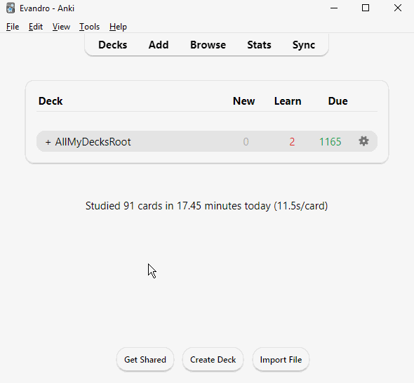

# Source Siblings Bury (Cousins)

Addon for scheduler V3 only.
Depending on how many cards are scheduled for today,
and if FSRS scheduler is enabled,
it may take several minutes to complete the card burring.
Anki addons are only for Desktop,
and not Android or Anki Web.
But you can use the desktop Anki to run the bury command with this addon,
and sync the buried cards with other devices or Anki Web to study there.

The source code can be found at [https://github.com/evandrocoan/AnkiAddons/tree/master/sibilingsbury](https://github.com/evandrocoan/AnkiAddons/tree/master/sibilingsbury).

## How it works

If a card has the field `Source`,
them any card which also has a `Source` field with the same contents and is scheduled for today,
is buried.

If a card has the field `Sibling`,
them any card which also has a `Sibling` field with the same contents and is scheduled for today,
is buried if any "sibling" cards are scheduled from today up to 7 days.

Basically,
cards with the same `Source` field are buried until the next day,
while cards with the same `Sibling` field are buried for 7 days.
`Source` bury is helpful for cards you do not want to see on the same day.
`Sibling` bury is helpful for cards that you do not like to see in the same week.

This does not interfere with Anki's built-in sibling bury features;
it only works for cards (notes) that do not have an empty `Source` or `Sibling` fields.
It will consider a card "sibling" from another if both cards have a `Source` or `Sibling` field
with the same contents.

### Example

Basically, you need to install the add-on,
create a field called `Sibling` for each note (cards),
and put a key like `anatomy card` on it.
Then, in every Anki note you do not want to see in the same week,
add the field `Sibling` with the content `anatomy card`.
This will create a bury "group" `anatomy card`
where every note with the `anatomy card` keyword will not show on the same week.
You can create other groups as `human bone cards,`
and every note on this "group" will not show up in the same week.

This is a manual process as it requires you to run the command `Tools -> Bury all siblings cards`
before starting studying,
but after that, you can sync with Anki Web and study on other devices such as AnkiDroid.
This bury technique,
works for every note with the field `Sibling`;
they do not need to be from the same note type.

## How to use

No cards are buried automatically.
On the main Anki window,
go to the menu `Tools -> Bury all siblings cards`.
This will bury all sibling's cards.
Now you can sync with other devices, and the buried cards will be propagated,
then, you can study other devices that do not support Anki Addons.
You can undo this plugin action by clicking on the `Unbury` button,
at the Anki deck review (at the bottom of the page,
where there is the `Study Now` button).



It also has the option `Tools -> Toggle skip empty cards`,
to also bury all cards which have an empty front.
It is useful when you leave unfinished cards with empty fronts.
For example, given the following front:
```
{{^IsThisReviewed}}
Question...
{{/IsThisReviewed}}
```
This card will be empty unless the "flag" field `IsThisReviewed`, which has no text on it.

## License

Source Siblings Bury is free and open-source software. The add-on code that runs within
Anki is released under the [GNU GPL v3](LICENSE.txt).
